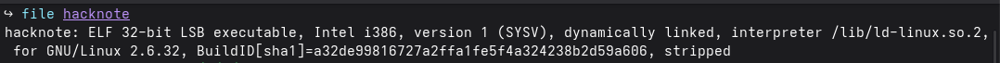
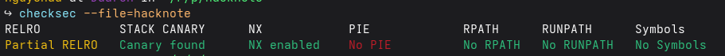
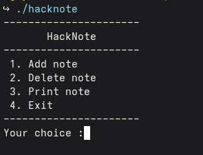

# Hacknote (200 pts) - Pwnable.tw
---

## <span style="color:red"> 0x1. Initial Reconnaissance </span>

### file


### checksec


### ./hacknote


---

## <span style='color:red'>0x2. Reverse Engineering</span>

### Add_note
```
unsigned int sub_8048646()
{
  int v0; // ebx
  int v2; // [esp-Ch] [ebp-34h]
  int v3; // [esp-Ch] [ebp-34h]
  int v4; // [esp-8h] [ebp-30h]
  int v5; // [esp-8h] [ebp-30h]
  int v6; // [esp-4h] [ebp-2Ch]
  int i; // [esp+Ch] [ebp-1Ch]
  int v8; // [esp+10h] [ebp-18h]
  char v9[8]; // [esp+14h] [ebp-14h] BYREF
  unsigned int v10; // [esp+1Ch] [ebp-Ch]

  v10 = __readgsdword(0x14u);
  if ( dword_804A04C <= 5 )
  {
    for ( i = 0; i <= 4; ++i )
    {
      if ( !dword_804A050[i] )
      {
        dword_804A050[i] = malloc(8);
        if ( !dword_804A050[i] )
        {
          puts("Alloca Error");
          exit(-1, v2, v4, v6);
        }
        *(_DWORD *)dword_804A050[i] = sub_804862B;
        printf("Note size :");
        read(0, v9, 8);
        v8 = atoi(v9);
        v0 = dword_804A050[i];
        *(_DWORD *)(v0 + 4) = malloc(v8);
        if ( !*(_DWORD *)(dword_804A050[i] + 4) )
        {
          puts("Alloca Error");
          exit(-1, v3, v5, v6);
        }
        printf("Content :");
        read(0, *(_DWORD *)(dword_804A050[i] + 4), v8);
        puts("Success !");
        ++dword_804A04C;
        return __readgsdword(0x14u) ^ v10;
      }
    }
  }
  else
  {
    puts("Full");
  }
  return __readgsdword(0x14u) ^ v10;
}
```

### Delete_note
```
unsigned int sub_80487D4()
{
  int v1; // [esp-Ch] [ebp-24h]
  int v2; // [esp-8h] [ebp-20h]
  int v3; // [esp-4h] [ebp-1Ch]
  int v4; // [esp+4h] [ebp-14h]
  char v5[4]; // [esp+8h] [ebp-10h] BYREF
  unsigned int v6; // [esp+Ch] [ebp-Ch]

  v6 = __readgsdword(0x14u);
  printf("Index :");
  read(0, v5, 4);
  v4 = atoi(v5);
  if ( v4 < 0 || v4 >= dword_804A04C )
  {
    puts("Out of bound!");
    _exit(0, v1, v2, v3);
  }
  if ( dword_804A050[v4] )
  {
    free(*(_DWORD *)(dword_804A050[v4] + 4));
    free(dword_804A050[v4]);
    puts("Success");
  }
  return __readgsdword(0x14u) ^ v6;
```

### Print_note
```
unsigned int sub_80488A5()
{
  int v1; // [esp-Ch] [ebp-24h]
  int v2; // [esp-8h] [ebp-20h]
  int v3; // [esp-4h] [ebp-1Ch]
  int v4; // [esp+4h] [ebp-14h]
  char v5[4]; // [esp+8h] [ebp-10h] BYREF
  unsigned int v6; // [esp+Ch] [ebp-Ch]

  v6 = __readgsdword(0x14u);
  printf("Index :");
  read(0, v5, 4);
  v4 = atoi(v5);
  if ( v4 < 0 || v4 >= dword_804A04C )
  {
    puts("Out of bound!");
    _exit(0, v1, v2, v3);
  }
  if ( dword_804A050[v4] )
    (*(void (__cdecl **)(int))dword_804A050[v4])(dword_804A050[v4]);
  return __readgsdword(0x14u) ^ v6;
}
```
---

## <span style="color:red">0x3. Analysis</span>

- First of all, this binary is 32-bits and stripped (but it doesn't matter). 
